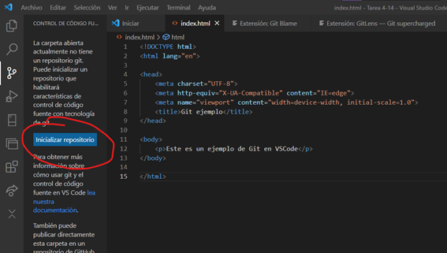
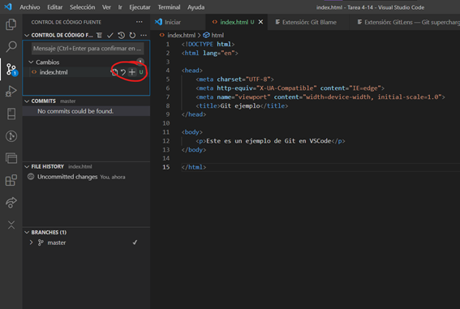
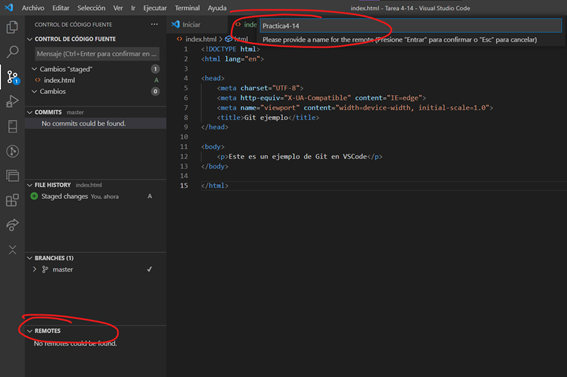

# Tarea 4.14. Visual Studio Code y Git

1.	Git add
Para iniciar un repositorio en Git desde la interfaz de VSCode, después de instalar las extensiones indicadas para poder usar Git, se creará una carpeta en la que se guardará el repositorio creado. Se le dará inicializar repositorio dentro de la carpeta.

2.	git commit cerrando un issue
Si hay que crear un “commit” se podrá hacer desde el apartado del control de código fuente en el apartado de Cambios.

3.	git push
Para realizar una subida con Git se podrá hacer dándole al apartado de agregar de “Remote”. Después saldrá una ventana emergente para poder darle un nombre al repositorio remoto.

4.	git checkout -b documentación
