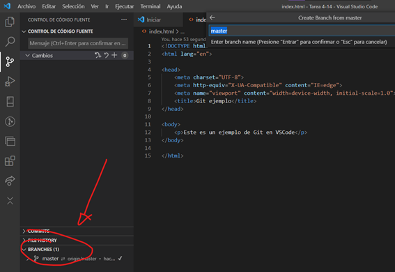
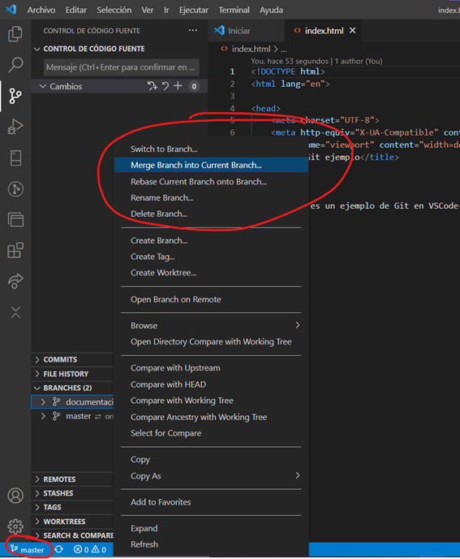
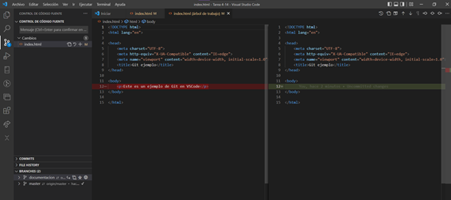
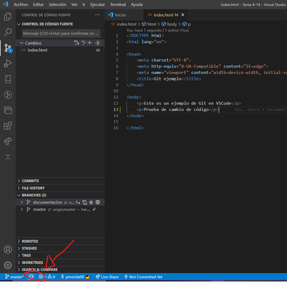
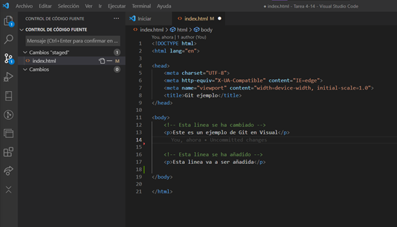

# Tarea 4.14. Visual Studio Code y Git

1.	Git add
Para iniciar un repositorio en Git desde la interfaz de VSCode, después de instalar las extensiones indicadas para poder usar Git, se creará una carpeta en la que se guardará el repositorio creado. Se le dará inicializar repositorio dentro de la carpeta.

2.	git commit cerrando un issue
Si hay que crear un “commit” se podrá hacer desde el apartado del control de código fuente en el apartado de Cambios.

3.	git push
Para realizar una subida con Git se podrá hacer dándole al apartado de agregar de “Remote”. Después saldrá una ventana emergente para poder darle un nombre al repositorio remoto.

4.	git checkout -b documentación
Para crear y posicionarse en otra rama solamente se necesitará darle click al botón de agregar en el apartado de “Branches” y ahí saldrá una ventana emergente para poder darle un nombre y luego poder subirla al repositorio remoto.

5.	git merge 
Para mezclar la rama actual con otra, hay que posicionarse en una rama y dar clic derecho a otra rama, y ahí habrá la opción de hacer un “Merge”.

6.	git diff
Para mirar los cambios del código con un “git diff” le daremos al icono de ver cambios de arriba a la derecha.

7.	git push
Para sincronizar los cambios y hacer todo el push del código modificado solo hay que darle a sincronizar código abajo a la izquierda

8.	Colores del margen del editor: rojo, verde, azul
Después de hacer los cambios y sincronizarlos, se puede deshacer o hacer cambios en el código y saldrán varios indicadores al margen que dirá que se ha añadido o eliminado una línea.

